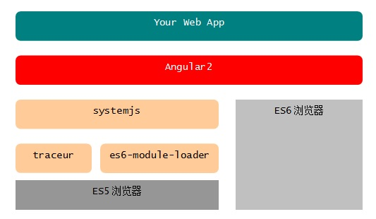
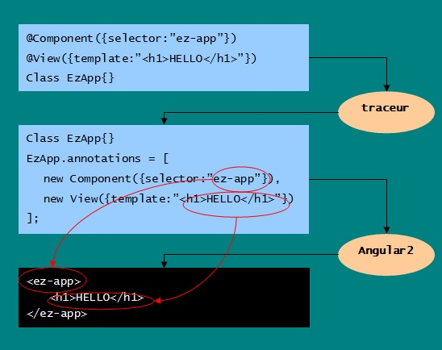
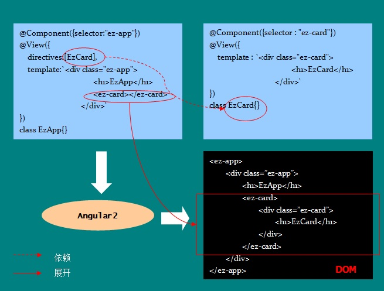
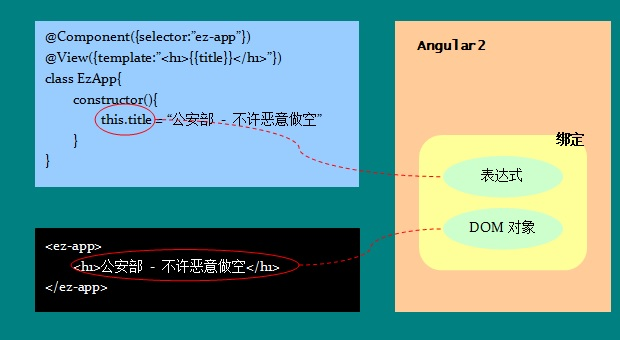
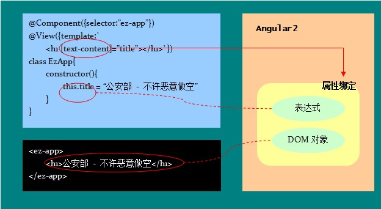
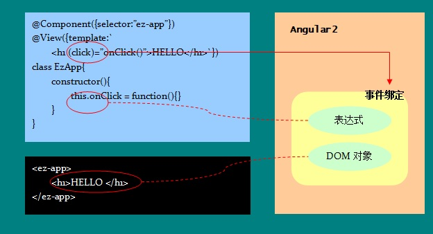
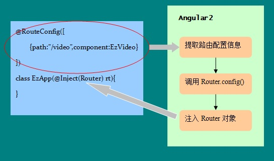

* systemjs -- 通用模块加载器，支持AMD、CommonJS、ES6等各种格式的JS模块加载
* es6-module-loader - ES6模块加载器，systemjs会自动加载这个模块
* traceur - ES6转码器，将ES6代码转换为当前浏览器支持的ES5代码。systemjs会自动加载 这个模块。

```html

<!doctype html>
<html>
<head>
	<meta charset="utf-8">
    <title>hello,angular2</title>
    <!--模块加载器-->
    <script type="text/javascript" src="lib/system@0.16.11.js"></script>
    <!--Angular2模块库-->
    <script type="text/javascript" src="lib/angular2.dev.js"></script>
	<script>
    	//设置模块加载规则
    	System.baseURL = document.baseURI;
		System.config({
        	map:{traceur:"lib/traceur"},
			traceurOptions: {annotations: true}
		});
	</script>	    
</head>
<body>

    <my-app></my-app>

    <!--定义一个ES6脚本元素-->
    <script type="module">
    	//用ES6语法定义一个类
        export class Logger{
        	constructor(){
            	this.el = document.querySelector("pre.logger");
                this.lines = [];
            }
            log(str){
            	this.lines.push(str);
                this.el.textContent = this.lines.join("\n");
            }
        }
        //实例化，测试一下
        var _ = new Logger();
        _.log("哎呦，不错哦！");
        _.log("真的是用ES6写的噢！");
    </script>
    <!--组件渲染锚点-->
	   
    <!--定义一个ES6脚本元素-->
    <script type="module">
    	//从模块库引入三个类型定义
        import {Component,View,bootstrap} from "angular2/angular2";
        
        //组件定义
        @Component({selector:"ez-app"})
        @View({template:"<h1>Hello,Angular2</h1>"})
        class EzApp{}       
        
        //渲染组件
        bootstrap(EzApp);
    </script>
    
  
</body>
</html>

```

### 注解/Annotation



```javascript

//使用注解功能需要先开启  traceurOptions: {annotations: true} 功能

System.config({
  map:{traceur:"lib/traceur"},
  traceurOptions: {annotations: true}
});

```

```html

<script type="module">
	//从模块库引入三个类型定义
    import {Component,View,bootstrap} from "angular2/angular2";
    
    //组件定义
    @Component({selector:"my-app"})
    @View({template:"<h1>Hello,Annotation</h1>"})
    class EzApp{}       
            
    //渲染组件
    bootstrap(EzApp);
 </script>

```


###模板

```javascript
	//1.内联模板, 内联样式
	@Component({selector:"my-app"})
	@View({
		styles:[`
	        h1{background:#4dba6c;color:#fff}     
	   `],
		template: `
			<h1>hello</h1>
		`
	})
	class MyApp{}
	
	2.外部模板, 外部样式
	@Component({selector:"my-app"})
	@View({
	   styleUrls:["ez-greeting.css"],
		template: "outerTemplate.html"
	})
	class MyApp{}

```
#### directives - 使用组件



#### model - 数据模型



#### property - 数据绑定



#### properties - 组件通信

```javascript

	//EzCard 
	@Component({
	    properties:["name","country"]
	    events:["change"]
	})
	
	//EzApp
	@View({
	    directives : [EzCard],
	    template : `<ez-card [name]="'雷锋'" [country]="'中国'" (change)="onChange()"></ez-card>`
	})

```

#### event - 监听事件



```javascript
// 等效写法
@View({template : `<h1 on-click="onClick()">HELLO</h1>`})

```

#### #var - 局部变量

```javascript

// 添加一个以#或var-开始的属性，后续的部分表示变量名， 这个变量对应元素的实例

@View({
    template : `
        <h1 #v_h1>hello</h1>
        <button (click) = "#v_h1.textContent = 'HELLO'">test</button>
    `
})
// #v_h1 表示 <h1 #v_h1>hello</h1> 这个实例

```


### 逻辑控制

#### ng-if
```javascript

	
	
	
	//在组件的ViewAnnotation中通过属性directives声明对该指令的引用
	@Component({
		selector : "ez-reader",
	    properties:["trial"]
	})
	@View({
		directives:[NgIf],
		template : `
		    
	       
	       <pre>{{content}}</pre>`
	})
	class EzReader{}
	
	// 两种写法
	//
	//

```

#### ng-swtch

```javascript

       @Component({
        	selector : "ez-promotion",
          properties:["gender"]
        })
        @View({
        	directives:[NgSwitch,NgSwitchWhen,NgSwitchDefault],
        	template : `
            	<div [ng-switch]="gender">
                	<template ng-switch-when="Male">
                    	
                    </template>
                	<template ng-switch-when="Female">
                    	
                    </template>
                	<template ng-switch-default>
                    	<h1>Learn Something, NOW!</h1>
                    </template>                    
                </div>
            `
        })
        class EzPromotion{}

```

#### ngfor

```javascript

	@Component({
		selector : "ez-star"
	})
	@View({
	
		directives:[NgFor],
		template : `	
			<div>
			<h2>Films</h2>
			<ul>
			<li *ng-for="#film of films;;#i=index">{{i}}.{{film}}</li>
			</ul>
			</div>
		`
	})
	class EzStar{
		constructor(){
			this.films = [
				"Mechanic: Rescurrection / 2016",
				"Spy / 2015",
				"Furious 7 /2015",
				"Wild Card / 2015",
				"The Expendables / 2014",
				"Home Front / 2013",
				"Hummingbird / 2013",
				"Fast & Furious 6 / 2013",
				"Parker / 2013"
			];
		}
	}

```


### Form

```javascript

	@Component({selector:"ez-app"})
	
	@View({
		directives:[NgIf,formDirectives],
		template:`
			<form>
				<ul>
					<li>姓名：<input type="text" ng-control="name" [(ng-model)]="data.name"></li>
					<li>姓别：
						<select ng-control="gender" [(ng-model)]="data.gender">
							<option value="Male">男</optoin>
							<option value="Female">女</optoin>
						</select>
					</li>
					<li>地址：<input type="text" ng-control="address" [(ng-model)]="data.address"></li>
					<li>电话：<input type="text" ng-control="telephone" [(ng-model)]="data.telephone"></li>
					<li>已婚：<input type="checkbox" ng-control="marriage" [(ng-model)]="data.marriage"></li>
				</ul>
			</form>
			<pre>{{decode(data)}}</pre>
		`,
	})
	class EzApp{
		constructor(){
			this.data = {
				name : "whoami"
			};
		}
		decode(val){
			return JSON.stringify(val,null,"\t");
		}
	}
    

```
### 注入
```javascript
//定义一个简单的算法服务
class EzAlgo{
    add(a,b) { return a+b; }
    sub(a,b) { return a-b; }
}

//不使用注入方式， 引用算法服务
@Component(...)
@View(...)

class EzApp{
    constructor(){
    	this.a = 37;
        this.b = 128;
        //实例化服务对象
        this.algo = new EzAlgo();
    }
    add(){
    	var a = +this.a,
        	 b = +this.b;
    	return this.algo.add(a,b);
    }
}
        
//
@Component({
    selector : "ez-app",
    //声明依赖
    appInjector : [EzAlgo]
})
@View(...)
class EzApp{
    //Angular2框架负责注入对象
    constructor(@Inject(EzAlgo) algo){
    	// @Inject(EzAlgo) algo 等同于 algo ＝ new EzAlgo()
        //已经获得EzAlgo实例了！
    }
}

```

### Router

```javascript

		@Component({selector:"ez-app"})
        @View({
        	directives:[RouterOutlet],
        	template : `
            	<nav>
                	<b (click)="go('/video')">video</b> | 
                	<b (click)="go('/music')">music</b>
                </nav>
                <main>
                	<!--声明路由出口-->
                	<router-outlet></router-outlet>
                </main>
            `
        })
        class EzApp{
        	constructor(@Inject(Router) rt,@Inject(LocationStrategy) ls){
                ls.pushState = function(){};
                this.router = rt;
                //配置路由
                this.router.config([
                    {path:"/video", component:EzVideo},
                    {path:"/music", component:EzMusic}
                ]);
            }
            go(path){
            	//根据给定的url，选中组件并在outlet中激活
            	this.router.navigate(path);
            }
        }
        
        @Component({selector:"ez-video"})
		@View({
        	template : `
            	<h1>I LOVE THIS VIDEO!</h1>
			`
        })
        class EzVideo{}
        
        @Component({selector:"ez-music"})
        @View({
        	template : `
            	<h1>THAT'S FANTASTIC MUSIC!</h1>
            `
        })
        class EzMusic{}
                
        bootstrap(EzApp,[routerInjectables]);


```

### RouteConfig




