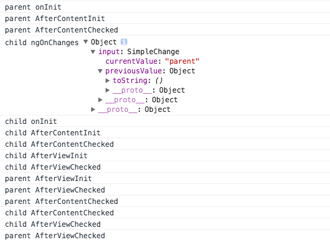
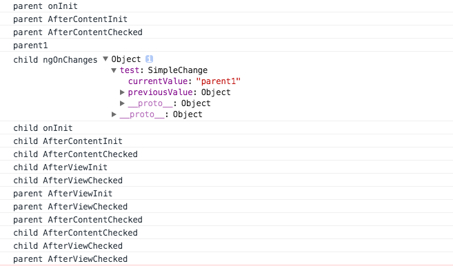
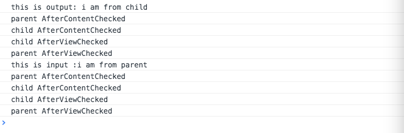

### @NgModule

NgModule是一个装饰器函数，它接收一个用来描述模块属性的元数据对象。其中最重要的属性是：

* declarations - 声明本模块中拥有的视图类。 Angular 有三种视图类：组件、指令和管道。
* exports - declarations 的子集，可用于其它模块的组件模板。
* imports - 本模块声明的组件模板需要的类所在的其它模块。
* providers - 服务的创建者，并加入到全局服务列表中，可用于应用任何部分。
* bootstrap - 指定应用的主视图（称为根组件），它是所有其它视图的宿主。__只有根模块才能设置`bootstrap`属性__。

```javascript

    import { NgModule } from '@angular/core';
    import { BrowserModule } from '@angular/platform-browser';
    @NgModule({
      imports:      [ BrowserModule ],
      providers:    [ Logger ],
      declarations: [ AppComponent ],
      exports:      [ AppComponent ],
      bootstrap:    [ AppComponent ]
    })
    export class AppModule { }

```
子模块中组件的使用,声明在exports中的组件可以被主模块使用

```javascript
    //子模块
    @NgModule({
        declarations: [
            FooterComponent
        ],
        exports:[
            FooterComponent
        ],
    })
    export class FooterModule {}
```

### @directive

1. Attribute directives  (是拓展dom属性的指令)
2. structural directives (是改变dom结构的指令)


```javascript

//Attribute directives

import {Directive, ElementRef, Renderer} from 'angular2/core';
@Directive({
  selector: '[redify]'
})
export class Redify {
  constructor(private _element: ElementRef, private renderer: Renderer) {
     // ElementRef，来获取当前的dom元素
     // Renderer服务来操作dom
      renderer.setElementStyle(_element.nativeElement, 'color', 'red');
  }
}


//structural directives
import {Directive, Input} from 'angular2/core';
//TemplateRef可以让我们获取指令所在的元素的template，ViewContainerRef提供了多种视图容器的方法。
import {TemplateRef, ViewContainerRef} from 'angular2/core';
@Directive({ selector: '[myUnless]' })
export class UnlessDirective {
  constructor(
    private _templateRef: TemplateRef,
    private _viewContainer: ViewContainerRef
    ) { }
  @Input() set myUnless(condition: boolean) {
    if (!condition) {
      this._viewContainer.createEmbeddedView(this._templateRef);
    } else {
      this._viewContainer.clear();
    }
  }

```


### 组件通信

1. 输入型绑定 －－ 从父组件传递数据到子组件最常见的方式。

```javascript
    //child
    @Component({

        selector: 'child',

        template: 'I am fron {{input}}'

    })

    export class ChildComponent implements OnInit {

        @Input()
        input;

        constructor() { }

        ngOnInit() { }

    }

    //parent
    @Component({

        selector: 'parent',

        template: '<child [input]="data"></child>'

    })

    export class ParentComponent implements OnInit {

        data: string;

        constructor() { }

        ngOnInit() {

            this.data = "parent";

        }

    }


```


2. setter监听

```javascript
    @Component({

        selector: 'child',

        template: 'I am from {{data}}'

    })

    export class ChildComponent implements OnInit {

        _input:string;

        @Input()

        public set input(v : string) {

            this._input = v;

            console.log(v);

        }

        public get input() : string {

            return this._input;

        }

        constructor() { }

        ngOnInit() { }

    }

```

3.ngOnChanges

4.事件传播－－子组件暴露一个 EventEmitter 属性，当事件发生时，子组件利用该属性 emits( 向上弹射 ) 事件。父组件绑定到这个事件属性，并在事件发生时作出回应。子组件的 EventEmitter 属性是一个 输出属性 ，通常带有 @Output 装饰器

```javascript

// child
export class ChildComponent {

    _input:string;

    @Input()
    public set test(v : string) {

        this._input = v;
        console.log(v);

    }
    public get test() : string {
        return this._input;
    }

    @Output()
    output:EventEmitter<string> = new EventEmitter<string>();

    click(){
        this.output.emit("i am from child");
    }


    constructor() { }
}

// parent
export class ParentComponent {

    data: string;

    constructor() { }

    output($event:any):void {
        console.log($event);
    }
}


```

5.本地变量

```javascript

@Component({

    selector: 'parent',

    template: '<child [input]="data" (output)="output($event)" #child></child>{{child.input}}'

})

export class ParentComponent implements OnInit {

    data: string;

    constructor() { }

    ngOnInit() {

        this.data = "parent";

    }

    output($event){

        console.log($event);

    }

}

```

6.ViewChild

```javascript

@Component({

    selector: 'parent',

    template: '<child [input]="data" (output)="output($event)" #child></child>{{child.input}}'

})

export class ParentComponent implements OnInit {

    @ViewChild(ChildComponent)
    private childComponent: ChildComponent;

    data: string;

    constructor() { }

    ngOnInit() {

        this.data = "parent";

    }

    output($event) {

        console.log($event);

    }

}


```

7.服务方式 -- 切记不要在子组件中再次注入服务

```javascript

// service
@Injectable()
export class Service {

    private inputSource = new Subject<string>();
    private outputSource = new Subject<string>();

    input$ = this.inputSource.asObservable();
    output$ = this.outputSource.asObservable();

    inputMission(mission:string):void {
        this.inputSource.next(mission);
    }
    outputMission(mission:string):void {
        this.outputSource.next(mission);
    }

    constructor() {

    }

}

//parent
@Component({

    selector: 'parent',

    template: '<child></child><button id="input" (click)="click()">click for input</button>',

    providers: [Service]

})

export class ParentComponent {

    constructor(private _service: Service) {

        this._service.output$.subscribe(function (output: string) {

            console.log("this is output: "+ output);

        });

    }

    click() {

        this._service.inputMission('i am from parent');

    }
}

// child 切记不要注入service
@Component({

    selector: 'child',

    template: `

    <button id="out" (click)="click()">click for output</button>

    `,
    providers:[]

})

export class ChildComponent {

    constructor(private _service: Service) {

    this._service.input$.subscribe(function (input: string) {

        console.log("this is input :" + input);

        })

    }

    click() {
        this._service.outputMission('i am from child');
    }
}

// import { Subject }    from 'rxjs/Subject';


```

